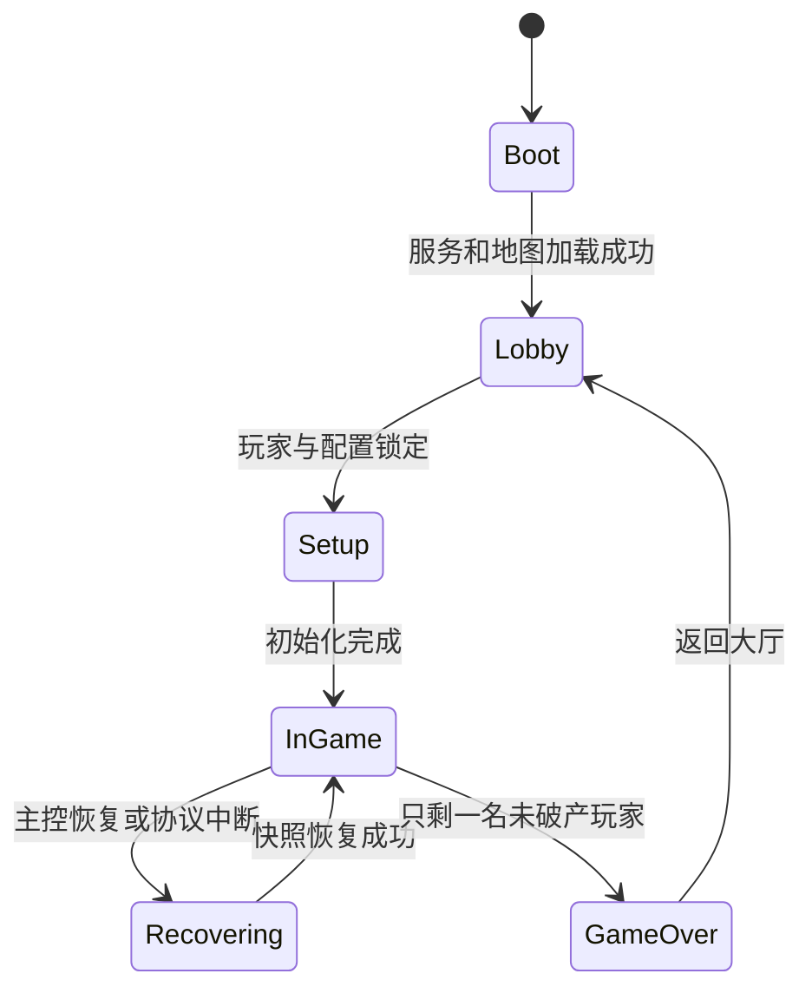
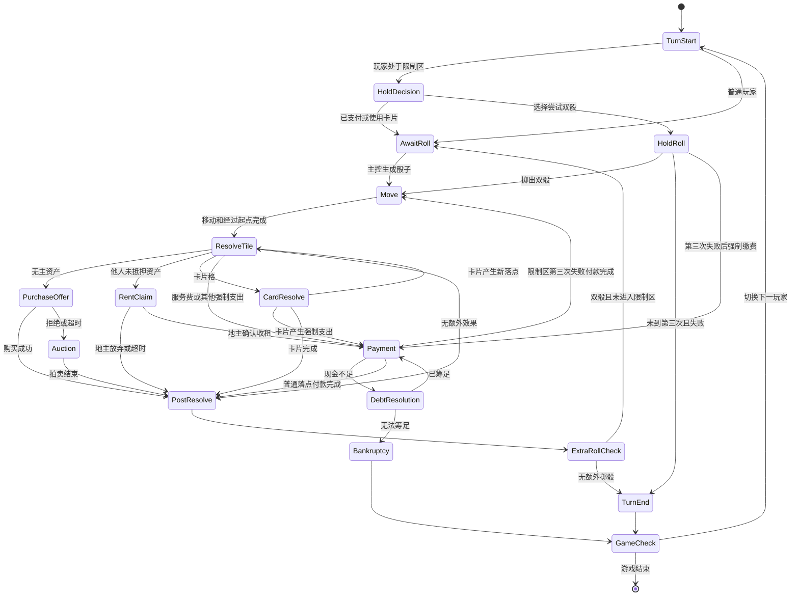
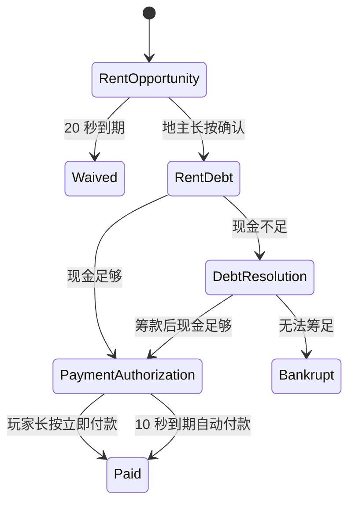
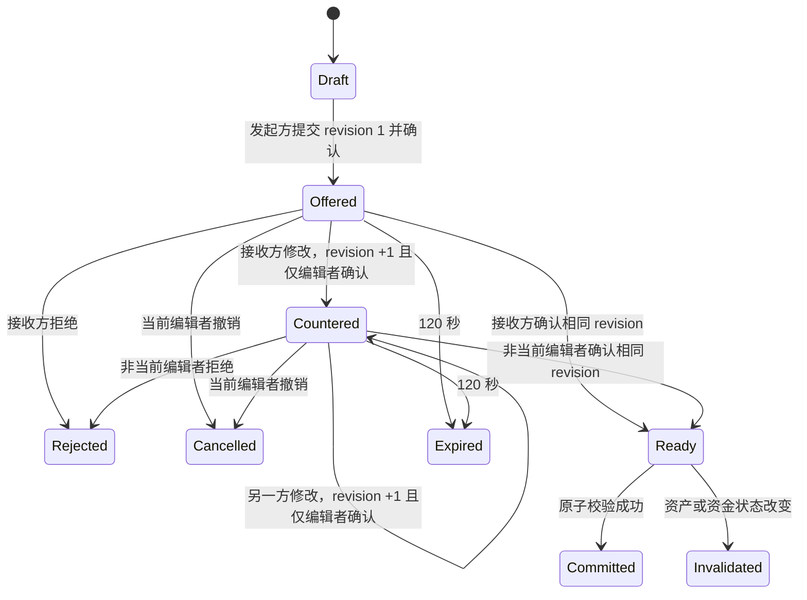

# Gridopoly 权威游戏状态机

状态：设计基线 1.0

更新日期：2026-08-02

## 1. 设计原则

- 树莓派主控持有唯一权威状态。
- 一次只允许一个会改变全局资产的提交事务。
- 圆屏显示状态可以动画化，但不能提前改变权威结果。
- 所有可重试命令都必须幂等。
- 所有倒计时使用主控绝对截止时间。
- 任何异常恢复后必须回到一个可继续裁决的明确状态。

## 2. 会话级状态

| 状态 | 主要职责 |
| --- | --- |
| `BOOT` | 加载配置、地图、经济表和持久化存档 |
| `LOBBY` | 热点、设备认领、玩家槽位和开局设置 |
| `SETUP` | 冻结地图经济、洗牌、决定顺序 |
| `IN_GAME` | 执行回合与事务 |
| `RECOVERING` | 恢复快照、回放已提交事务、拒绝危险输入 |
| `GAME_OVER` | 冻结最终结果并显示胜者 |

## 3. 回合主状态机

## 4. 回合状态定义

### 4.1 `TURN_START`

- 锁定当前玩家和回合编号。
- 清零本回合双骰计数之外的临时操作。
- 检查破产、限制区和待恢复事务。
- 向所有终端广播当前顺序。

### 4.2 `AWAIT_ROLL`

- 只有当前玩家可提交 `ROLL_REQUEST`。
- 主控生成随机结果并写入事件日志后才广播骰子。
- 相同请求 ID 的重发返回原结果，不能重新随机。

### 4.3 `MOVE`

- 逐格计算路径和经过起点次数。
- 权威位置只在事件提交后改变。
- 圆屏动画时长不阻塞主控，但主控应等待客户端最低展示窗口后再发送会遮挡动画的
  普通提示。

### 4.4 `RESOLVE_TILE`

- 根据最终落点类型选择唯一处理分支。
- 同一落点不能同时创建购买和租金事务。
- 卡片移动产生的新落点重新进入本状态。

### 4.5 `POST_RESOLVE`

- 验证当前落点没有未解决债务、购买、拍卖或卡片。
- 清理已完成的临时操作。
- 进入额外掷骰判断。

强制付款事务必须携带 `continuation`。普通租金、服务费和卡片付款使用
`POST_RESOLVE`；限制区第三次失败产生的 $50 付款使用 `MOVE`，并继续使用已经写入
事件日志的骰子结果。

## 5. 收租与付款状态机

### 5.1 收租机会

- `deadline = server_now + 20s`。
- 地主确认前不建立债务，付款方余额不变。
- 确认和超时竞争时，以主控收到并验证命令的时间为准。
- 超时提交返回 `DEADLINE_EXPIRED`。

### 5.2 付款授权

- `deadline = server_now + 10s`。
- 窗口只提供立即付款，不提供拒绝债务。
- 自动付款和手动付款使用同一个幂等事务 ID。
- 付款后余额不得为负；不足时必须先进入筹款。

## 6. 购买与拍卖状态机

| 状态 | 允许操作 | 结束条件 |
| --- | --- | --- |
| `PURCHASE_OFFER` | 购买、放弃 | 购买成功或进入拍卖 |
| `AUCTION_OPENING` | 真人终端按拍品与 generation 幂等 Ready；机器人自动 Ready | `ready_mask == required_ready_mask` |
| `AUCTION_OPEN` | 所有有效玩家出价/退出 | 只剩最高有效出价者或无人出价 |
| `AUCTION_SETTLE` | 无玩家输入 | 原子扣款并转移资产 |

- 购买是自愿支出，超时等同放弃而不是自动购买。
- `AUCTION_OPENING` 必须冻结竞价者和机器人调度；新拍卖清空 ready mask 并使用新的非 0 generation。
- 拍卖期间不能发起普通交易来为当前出价筹款。
- 最高出价者资金变化导致无法结算时，该出价无效，恢复到下一有效出价状态。

## 7. 筹款状态机

`DEBT_RESOLUTION` 保存以下不可变债务信息：

- 债权方
- 金额
- 用途
- 来源事件
- 事务 ID

允许的子操作：

- `SELL_BUILDING`
- `MORTGAGE_ASSET`
- `DECLARE_BANKRUPTCY`

`PROPOSE_TRADE` 是后续强制债务筹资扩展；普通交易 v1 不在 `DEBT_RESOLUTION` 中开放。

每个操作完成后重新计算可用现金。达到债务金额时返回付款授权，不自动执行其他
抵押或出售。筹款期间回合时钟和付款倒计时暂停。

## 8. 交易状态机

- 草案拥有独立 tradeId 和 revision；任意修改会撤销另一方确认，但保留编辑者对新 revision 的确认。
- 最终确认使用 1.2 秒顶层长按弹窗。
- 提交时重新验证所有权、抵押、建筑、现金和未解决债务。
- 提交失败不得执行部分交换。
- 普通交易仅在 `AwaitRoll` 或 `TurnEnd` 变更和结算；断线恢复使用独立按需交易投影，
  不扩大 State/Authority/Roster。

## 9. 建设与抵押事务

- 每次建设、出售、抵押和赎回都是独立事务。
- 主控先验证完整地区组、均匀建设、库存和现金，再一次提交。
- 地区组锁只持续到当前事务结束，不允许两个客户端同时修改同一组。
- 客户端看到过期资产版本时返回最新资产详情，不猜测用户意图。

## 10. 限制区状态

玩家记录：

- `in_hold`
- `failed_hold_rolls`，范围 0 至 2
- 可用脱离限制区卡片列表

第三次失败会先建立 $50 强制债务。债务完成后才按已经记录的骰子结果移动。该骰子
结果不可重新生成。

## 11. 破产与游戏结束

破产事务按顺序执行：

1. 冻结破产玩家的全部操作。
2. 确认债权方和最终债务。
3. 处理建筑库存回收。
4. 转移或回收现金、资产和卡片。
5. 从回合顺序移除玩家。
6. 记录不可变破产事件。
7. 检查是否只剩一名未破产玩家。

任何步骤失败都回滚整个破产事务并进入 `RECOVERING`，不得留下半完成状态。

## 12. 并发优先级

从高到低：

1. 恢复与状态冲突
2. 强制债务与破产
3. 当前拍卖或交易提交
4. 当前回合落点处理
5. 普通资产浏览和交易草案编辑

低优先级操作不能抢占高优先级事务。资产浏览永远不加全局锁。

## 13. 持久化边界

必须在以下事件后写入持久化快照或追加事件日志：

- 骰子结果生成
- 位置提交
- 资产购买或拍卖成交
- 租金债务建立与支付
- 卡片抽取与执行
- 交易提交
- 建设、出售、抵押和赎回
- 进入或离开限制区
- 破产与游戏结束

仅用于显示的动画进度、焦点位置和本地滚动位置不进入主控存档。

## 14. 核心不变量

- 玩家现金永不为负。
- 一个资产最多有一个所有者。
- 已抵押地产不收租。
- 同组建筑等级差不超过 1。
- 地标与四级建筑不能同时存在于同一地产。
- 破产玩家不在有效回合顺序中。
- 一个强制债务最多结算一次。
- 主控状态版本严格单调递增。
- 已提交事件的随机结果不可因重连或重试改变。
