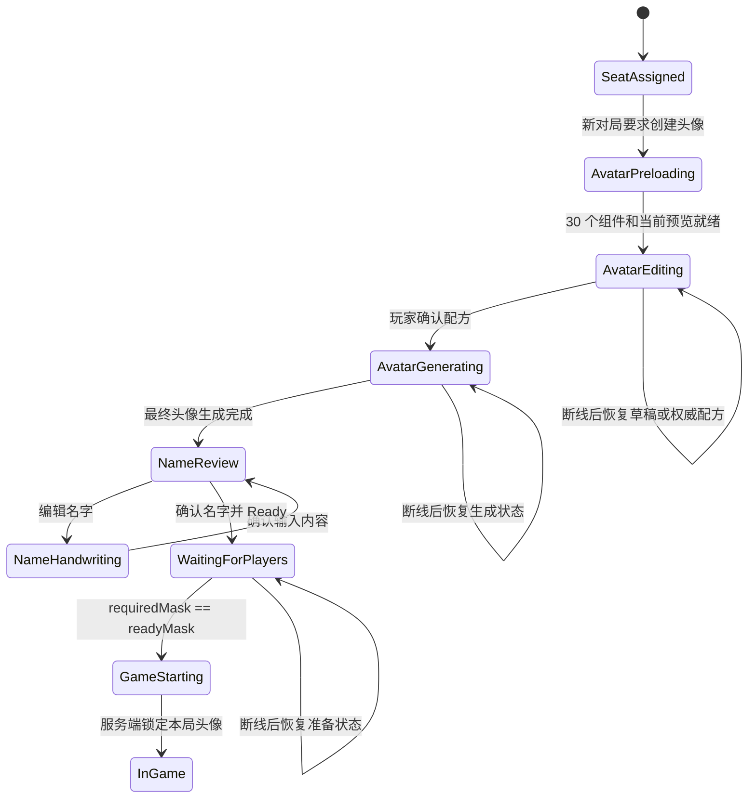

# Gridopoly 玩家开局头像创建规格

状态：当前实现规范；协议与素材已冻结，等待 ARM64 部署和 COM4 实机发布验收

更新日期：2026-08-06

## 1. 目标

每次建立新对局并完成座位认领后，所有真人玩家先在自己的 2.1 英寸圆屏上创建头像。
玩家可以组合发型、发色、面部、肤色和服装；机器人由权威服务端自动生成组合。只有本局
所有必需玩家都确认后，服务端才允许进入正式游戏。

头像系统只提供身份识别和个性化外观，不提供技能、初始资金、投骰、交易或其他规则加成。

本文冻结产品语义、页面结构和验收目标。协议消息、字段偏移、素材目录、GAVC 组件格式和
缓存预算以共享协议及 `Docs/firmware/avatar-component-protocol.md` 为单一来源。

## 2. 范围

### 2.1 当前功能包含

- 新对局的 `Avatar Setup` 会话阶段。
- 圆屏左侧 Focus Stack 编辑区与右侧静态半身预览区。
- 五类外观参数和确认操作。
- 真人确认屏障、机器人自动生成和断线恢复。
- 由同一份外观配方生成圆形玩家头像。
- 玩家列表、交易、付款、活动记录、拍卖和网页主控统一使用该头像。

### 2.2 不包含

- 自由绘画、照片上传、摄像头拍照或生成式人脸。
- 任意 RGB 调色盘；首版只使用审核过的离散色板。
- 服装、发型或面部带来的规则能力。
- 在对局进行中修改头像。
- 将完整头像位图写入常规 State/Auth/Roster 高频快照。

## 3. 会话流程



权威顺序：

1. 树莓派创建房间、确定玩家数量并分配座位。
2. 进入 `AvatarSetup` 后，真人席位先显示统一素材准备页：当前配方三层优先，然后下载全部
   30 个 Hair/Face/Outfit 组件；机器人立即生成并确认配方。
3. 真人在本机编辑草稿；编辑过程只需本地预览，不把每一次旋钮变化发送给服务端。
4. 玩家按下 `CONFIRM` 后，终端提交完整配方和幂等请求 ID。
5. 服务端校验目录版本和全部预设 ID，记录配方并设置该席位的 confirmed bit。
6. 全部必需席位确认后，服务端锁定头像并进入游戏初始化。
7. 对局开始后，任何终端都不能再修改本局配方。

每次新建对局都重新进入头像创建。未来可以增加“使用上次外观”快捷项，但不能绕过本局确认。

## 4. 480×480 页面布局

页面保持当前机械 60°、固件 0°基线，所有坐标均为正向 480×480 逻辑画布。

### 4.1 安全布局

- 页面标题带：`x=116..364`、`y=38..76`。
- 主工作区：`x=44..436`、`y=82..414`。
- 左侧 Focus Stack 编辑区：五行分别从 `x=108/94/84/94/108` 开始，宽度为
  `154/168/178/168/154`，借宽度变化贴合左侧圆弧。
- 右侧半身预览原点：`x=232,y=62`，缩放为 218/256；不添加头像圆框，不显示调试配方文本。
- 两区之间保留至少 8 px，不使用独立浮动卡片套卡片。
- 所有文字、焦点框和预览不得越出半径 192 px 的主内容安全圆。

圆屏边缘会裁掉矩形工作区四角，因此左侧控件使用靠中轴的 Focus Stack，右侧使用半身构图，
不能简单把普通横屏表单按比例缩小。

### 4.2 左侧固定六槽 Focus Stack

左侧从上到下固定为：

| 槽位 | 英文显示 | 中文含义 | 行为 |
| --- | --- | --- | --- |
| 1 | `HAIR` | 发型预设 | 选择发型 ID |
| 2 | `HAIR COLOR` | 发型颜色 | 选择离散发色色板 |
| 3 | `FACE` | 面部预设 | 选择五官与表情组合 |
| 4 | `SKIN TONE` | 面部/肤色 | 选择离散肤色色板 |
| 5 | `OUTFIT` | 衣服预设 | 选择服装轮廓与主配色 |
| 6 | `CONFIRM` | 确认外貌 | 提交配方并开始生成最终头像 |

五个参数槽位置固定，不因某项不可用或目录缺失而重排。五行 y 坐标固定为
`108/154/200/246/292`，行高 38 px；确认按钮固定为 `x=108,y=342,w=154,h=46`。
当前焦点行显示完整边框和强调色，非焦点行只保留文字、序号和分隔线，避免六张卡片挤占圆屏。

每个参数行显示类别短名、当前预设编号或简短名称、左右切换箭头。颜色项使用真实色块，不能只显示
颜色文字。左侧不显示长说明、功能教程或常驻操作提示。

### 4.3 右侧预览

- 使用 `220x300` 静态半身预览，原点为 `(244,78)`；构图向左上收紧，必须完整显示头部、
  颈部和肩部，且不遮挡下方玩家名。
- 编辑页不使用圆形裁切参考环。最终 128x128 公共头像才使用圆形裁切。
- 参数改变后只替换受影响图层，不播放夸张转场；允许 120 至 180 ms 淡入，避免硬切。
- 预览下方显示当前席位占位名和编辑进度，不能被半身像覆盖。
- 已确认时显示清晰的锁定状态；等待其他玩家时仍保留完整头像，不切换为单独等待页。
- 素材未就绪时显示居中的加载环，不显示错误角色、地产图或旧头像占位图。

### 4.4 确认后的页面

短按 `CONFIRM` 提交完整配方。立即响应为 `AvatarGenerating` 时，原页显示 `SAVING` 并冻结
重复提交；服务端异步生成最终头像完成后，以更高版本 IdentitySnapshot 发布 avatarFinal，
客户端必须清除 pending 并进入独立的 Name Review 页面。不能因为后续完成帧 requestId 为 0
而永久停留在 SAVING，也不能把 State/Auth/Roster 误当作头像已保存。

确认外貌后不允许返回修改，因为服务端生成的最终头像和 avatarRevision 已成为本局权威身份。
确认名字后进入 Player Ready 页面；该页显示全部玩家最终头像、名字和准备状态。全部必需真人
准备后在同一页倒计时五秒，再统一进入游戏。

## 5. 输入模型

头像页继续使用旋钮主导的统一焦点模型。

### 5.1 旋钮

1. 非修改状态旋转：在五个参数行和确认按钮之间移动焦点。
2. 短按参数行：进入该行修改状态。
3. 修改状态旋转：按离散目录循环切换预设；预览实时更新。
4. 再次短按：退出修改状态并保留本地草稿。
5. 长按不承担普通选项修改，避免与全局危险确认语义冲突。

修改状态必须有明确的左右箭头、强调色和轻微边框动画。旋钮到达目录首尾时采用短距离阻尼回弹，
不能跳到无效 ID；是否循环首尾由最终可用性测试决定，首版建议循环。

### 5.2 触摸

- 点击参数行会聚焦并进入修改状态。
- 点击行内左/右半区分别切换上一个/下一个预设。
- 点击右侧预览只做短暂放大检查，不提交配方。
- 点击 `CONFIRM` 等同旋钮短按。
- 页面不依赖滑动手势完成必需操作。

### 5.3 确认与撤销

头像没有资金或资产风险，使用短按确认，不使用 1.2 秒长按。服务端未接受前显示轻量提交进度；
成功后才进入权威 `Confirmed` 状态。提交失败时保留草稿和焦点，不清空用户选择。

## 6. 外观配方

服务端和终端交换结构化配方，不上传或广播完整位图。

```text
AvatarRecipe
  avatarVersion: u16
  hairPresetId: u8
  hairColorId: u8
  facePresetId: u8
  skinToneId: u8
  outfitPresetId: u8
```

约束：

- 所有 ID 只在指定 `avatarVersion` 的目录中解释。
- 显示名称不是主键，语言切换不能改变配方。
- 配方序列化必须固定字节序并保留未来扩展位。
- 目录升级不得静默改变已存档配方的视觉含义。
- 服务端拒绝越界 ID、未知版本和保留位非零的请求。

首版建议目录规模：

| 类别 | 建议数量 | 说明 |
| --- | ---: | --- |
| 发型 | 10 | 短发、长发、卷发、辫发、光头等明显轮廓 |
| 发色 | 20 | 14 种自然/染发色与 6 种高辨识度城市强调色 |
| 面部 | 10 | 五官、眉形、脸型和友好表情组合 |
| 肤色 | 8 | 从浅到深均匀覆盖，不与面部预设绑定 |
| 服装 | 10 | 现代城市职业与休闲轮廓，不提供职业技能暗示 |

该建议可形成 51,200 种组合。正式数量以素材预算、可辨识度和文化审查结果为准。

## 7. 视觉与图层

头像采用面向欧美玩家的现代 2D 桌游卡通风格：自然眼睛比例、清晰平面轮廓、友好表情，
不使用日系动漫大眼、写实照片、3D 渲染或受保护角色造型。

### 7.1 单一注册母版

每个 `avatarVersion` 必须冻结一张正面中性注册母版。发型、面部和服装都以同一母版的画布、
头部位置、眼线、下巴、颈部和肩线为准，不得混用旧版完整角色图或另一名角色作为几何参考。

V1 样片的正式母版为
`Assets/GridCity/Avatars/V1/source/reference/avatar-registration-master-gridopoly-v2-chroma.png`：

- 源素材画布固定为 1254×1254；设备校准画布为 320×320。
- 母版采用正面、无透视、静态半身构图；生成新预设时不得改变相机、缩放、姿态和裁切。
- 生成图使用纯色键控背景 `#ff00e6`，随后转换为 RGBA；背景不得包含渐变、阴影、纹理或文字。
- 每次只生成一个独立图层，不得夹带其他部位。透明边缘不得残留洋红色溢色。
- 96×96、128×128 和 320×320 圆形裁切下都必须保持主体可辨识。

### 7.2 图层合同与遮挡顺序

V1 运行时固定由后向前合成：`face -> outfit -> hair`。也就是头发在最前，服装只在颈线以下
覆盖面部底层。未来若把头发拆成前后两层，可扩展为
`background -> back-hair -> face -> outfit -> front-hair -> highlights`，但不能改变可见遮挡语义。

| 图层 | 允许内容 | 禁止内容 |
| --- | --- | --- |
| `face` | 头部、耳朵、完整颈部、五官和肤色明暗 | 发型、服装、背景、文字 |
| `outfit` | 颈线以下的衣领、肩部和上身服装 | 头、脸、耳朵、皮肤、颈部像素 |
| `hair` | 发丝、发际线、鬓角和必要的面部边缘重叠 | 脸、皮肤、耳朵、颈部、服装、饰物 |

图层文件必须保持相同透明画布，不得先紧裁再依赖运行时猜测锚点。发型与面部不得用性别、族裔
或能力标签命名；玩家可以自由组合任何发型、肤色、面部和服装。

所有 `face` preset 的颈部接口必须逐像素兼容 `F01 Angular oval`。V1 构建器从源画布
`y=936` 开始平滑锁定，并从 `y=960` 到底部完全使用 F01 的颈宽、颈长和下边缘；AI 只负责该接口
以上的脸型与五官差异。这样既保留不同下颌、颧骨和五官，也保证所有服装领口可以无条件复用。

### 7.3 AI 生成共同约束

所有分层素材提示词必须包含以下硬约束：

- 正面正交视图、现代欧美 2D 桌游卡通、粗而干净的深色轮廓、克制的多边形赛璐璐明暗。
- 严格匹配注册母版的头部宽度、眼线、下巴、颈宽、肩点和构图比例。
- 只生成目标图层；无文字、Logo、道具、环境、投影或额外人体部位。
- 使用统一 `#ff00e6` 色键背景并保留完整 1254×1254 注册画布。
- 同一预设的颜色变体不得重新生成几何；颜色由程序或构建阶段从同一个已审核母版派生。

AI 输出只是候选源文件，必须经过透明度、边缘、对位和所有组合审核后才能进入 manifest。

### 7.4 发型生成规则

- 发型内侧发际线和左右鬓角必须贴合注册母版头部，留有少量遮缝重叠，但不得盖住眼睛或眉毛。
- 中央面部开口必须透明；不得用不透明底色填充头部轮廓。
- 左右外轮廓不能为了“蓬松”而无限加宽。若宽度或脸部开口错误，必须重新生成或重绘，不能靠
  运行时缩放修复。
- `H01 Angular crop` 已因旧版过宽更换为窄版
  `source/layers/hair/hair-h01-angular-crop-v3.png`；该版本是 V1 的验收基准。
- 发色只改变审核过的发丝色域，黑色轮廓、透明区和高光结构保持不变。

### 7.5 服装与颈部安全区

- 服装必须以注册母版的颈宽、原始领口和肩点为几何基准。
- 完整颈部以及原始领口以上的所有像素必须透明；衣服不得重新生成皮肤或脖子。
- 领口不得过宽，也不得用过大的 V 形开口。衣领、翻领或立体结构可以存在，但不得进入颈部
  Alpha 安全区或遮住下巴。
- `O01 Utility bomber v2` 是窄领口基准；`O02 Operations jacket` 已确认合规并保留。
- 工作提示词和 Alpha 检查详见
  `Assets/GridCity/Avatars/V1/OUTFIT_GENERATION_SPEC.md`。

### 7.6 发色与肤色派生

发色和肤色优先通过审核过的 Alpha/色域蒙版程序化着色；若设备端实时着色性能不足，可在树莓派
构建阶段预生成离散颜色变体，但 wire 配方保持不变。

- 肤色只处理暖色、高饱和度的皮肤平面和对应阴影。
- 眼白、虹膜、眉毛、睫毛、嘴部线稿、黑色轮廓、头发和服装不得被肤色算法染色。
- 明暗关系必须由源图保留，换色只能调整色相/饱和度/明度映射，不能覆盖成单一平涂色。
- 色板使用稳定 ID 和审核过的离散 RGB 值；颜色变化不重新调用 AI 生成。
- 每种肤色与每个面部预设都要组合检查，不能只检查默认面部。
- V1 肤色目录固定为 `Porcelain`、`Fair`、`Warm`、`Golden`、`Olive`、`Bronze`、
  `Deep` 和 `Ebony`。`warm` 与 `deep` ID 保持兼容，其余 ID 只扩展目录，不改变面部几何。

### 7.7 每个预设的独立对位

每个发型、面部和服装预设都持有独立的设备像素 `x/y` 偏移。编辑器在选中某个 preset 时，
右侧等高位置显示该 preset 的水平和垂直滑块；切换前保存当前值，切换后载入新 preset 自己的值。
偏移只用于精确平移，范围为 -48 至 +48 device pixels。素材宽度、缩放或内轮廓错误必须回到源图
重新生成，不能增加 scale 参数掩盖问题。

校准工具通过 `COPY ALL OFFSETS` 导出 schema 2 JSON。V1 当前校准基线为：

```json
{
  "schema": 2,
  "unit": "device-pixels-320",
  "hair": {
    "H01": { "x": 0, "y": -11 },
    "H02": { "x": 0, "y": -24 },
    "H03": { "x": -2, "y": -28 },
    "H04": { "x": 0, "y": -20 },
    "H05": { "x": 0, "y": -33 },
    "H06": { "x": 0, "y": -33 },
    "H07": { "x": 0, "y": 2 },
    "H08": { "x": 0, "y": -15 },
    "H09": { "x": 0, "y": -24 },
    "H10": { "x": -1, "y": -10 }
  },
  "face": {
    "F01": { "x": 0, "y": 0 },
    "F02": { "x": 0, "y": 0 },
    "F03": { "x": 0, "y": 0 },
    "F04": { "x": 0, "y": 0 },
    "F05": { "x": 0, "y": 0 },
    "F06": { "x": 0, "y": 0 },
    "F07": { "x": 0, "y": 0 },
    "F08": { "x": 0, "y": 0 },
    "F09": { "x": 0, "y": 0 },
    "F10": { "x": 0, "y": 1 }
  },
  "outfit": {
    "O01": { "x": 0, "y": 31 },
    "O02": { "x": 0, "y": 33 },
    "O03": { "x": 0, "y": 31 },
    "O04": { "x": 0, "y": 31 },
    "O05": { "x": 0, "y": 31 },
    "O06": { "x": 0, "y": 31 },
    "O07": { "x": 0, "y": 48 },
    "O08": { "x": 0, "y": 52 },
    "O09": { "x": 0, "y": 48 },
    "O10": { "x": 0, "y": 31 }
  }
}
```

接受后的偏移写入 `Assets/GridCity/Avatars/V1/avatar-layers.manifest.json` 的 `deviceOffsets`。
校准页面重新打开时滑块显示 manifest 的绝对基线值。设备图层已经烘焙该基线，所以页面预览只应用
“当前滑块值减去基线值”的差值，避免重复偏移；导出结果始终是可直接写回 manifest 的绝对值。

### 7.8 素材发布门禁

- 逐项验证 1254×1254 源文件与 320×320 设备文件的尺寸、RGBA、透明四角和无色键残留。
- 静态审查保留 271 张两两覆盖结构样本，并分别生成 H01-H10、F01-F10、O01-O10、全部发色和
  全部肤色对比图；运行时仍支持完整 `hair × face × outfit` 组合。进入设备固件前再执行全目录
  组合自动检查，不要求把 1,000 张冗余合成图长期纳入素材包。
- 检查头顶、鬓角、耳朵、下巴、颈部、领口和肩点无缝隙、穿帮或不应有的遮挡。
- 预组合预览和运行时独立图层必须使用同一 manifest 偏移并得到相同结果。
- 在 96×96 与 128×128 最终圆形头像上复查辨识度；只在大图正确不算通过。
- 新文件只能通过 manifest 稳定 ID 上线；不得静默替换旧 ID 的视觉含义。

### 7.9 V1 发型与发色目录

V1 测试目录已扩展到 10 个发型：`H01 Angular crop`、`H02 Asymmetric bob`、
`H03 Textured quiff`、`H04 Curly fade`、`H05 Classic side part`、`H06 Short coils`、
`H07 Shoulder waves`、`H08 Braided crown`、`H09 High bun` 和 `H10 Long straight`。

`H05`、`H06`、`H08` 使用收窄后的 `v2` Alpha 母版；修正同时收窄外轮廓和脸部开口，
不允许在运行时增加独立缩放参数代替源图修复。

20 个发色 ID 为 `graphite`、`copper`、`raven`、`espresso`、`chestnut`、`golden`、
`platinum`、`city-teal`、`ash-brown`、`auburn`、`mahogany`、`honey-blonde`、
`strawberry-blonde`、`silver`、`snow-white`、`burgundy`、`rose-pink`、`violet`、
`cobalt-blue` 和 `emerald`。其中后六种为高辨识度城市强调色，其余覆盖冷暖自然色与常见染发色。
所有颜色都从同一发型 Alpha 母版程序化派生，不单独调用 AI，因此轮廓和对位完全一致。

### 7.10 V1 面部目录

V1 面部目录为：`F01 Angular oval`、`F02 Soft square`、`F03 Round youthful`、
`F04 Heart taper`、`F05 Elegant oblong`、`F06 Diamond angular`、`F07 Broad strong`、
`F08 Soft triangle`、`F09 Narrow refined` 和 `F10 Mature sculpted`。

F02 已重新生成，必须通过更宽的软方下颌、较短下巴和不同眼鼻比例与 F01 明确区分。F05 使用
女性化的修长脸型、柔和下颌和细致眉眼，不再使用 Long rectangle 名称。其余预设
分别用脸型轮廓、颧骨、眉眼、鼻梁和下巴比例建立差异；不得仅修改阴影或肤色冒充新 preset。
所有面部共用 F01 的颈部接口和同一眼线注册点，肤色仍由同一源图程序化派生。

### 7.11 V1 服装目录

V1 服装目录为：`O01 Utility bomber`、`O02 Operations jacket`、`O03 Streetline hoodie`、
`O04 Metro varsity`、`O05 Civic blazer`、`O06 Workshop vest`、`O07 Signal knit`、
`O08 Denim commuter`、`O09 Rainline shell` 和 `O10 Gala tailored`。

O01 是窄领口注册基准，O02 保留用户确认合规的既有版本。O03-O10 均为服装独立 Alpha 图层，
不得包含皮肤、脖子、头部、头发或手；完整颈部以及注册母版原始领口以上区域必须透明。所有新服装
先继承 O01 的注册和设备偏移，再通过 O01/F01/H01 组合审查图校准 X/Y；如果领口宽度、几何或
肩线错误，必须回到源素材重做，不能通过运行时缩放修复。

静态构建产物保留 271 张两两覆盖结构样本，并使用 `review/avatar-outfit-presets-v1.png` 专门审查
O01-O10 的领口、颈部和肩点。运行时仍可独立组合全部 10×10×10 种结构配方。

## 8. 圆形头像派生与使用

确认后的配方在各端渲染成相同的圆形头像：

- 圆屏常规头像目标为 96×96 或 128×128。
- 网页可使用 128×128 或更高分辨率，但裁切中心和图层顺序必须一致。
- 外圈使用玩家席位色，头像本身不依赖颜色表达唯一身份。
- 玩家名独立渲染，不烘焙进头像位图。
- 交易、付款、拍卖、玩家详情、活动记录和胜利页都引用同一个配方。
- 系统/City Bank 使用独立系统图标，不伪装成玩家头像。

## 9. 素材分发与缓存

头像素材沿用树莓派 Wi-Fi 按需资源服务，但与地产图片使用不同的 manifest 类型。建议目录：

```text
Assets/GridCity/Avatars/
  manifest.json
  source/
  device/
    hair/
    face/
    skin/
    outfit/
```

未来实现应满足：

- manifest 包含 `avatarVersion`、稳定 ID、图层、尺寸、色深、长度和内容哈希。
- 编辑页打开前显示独立进度页，先下载当前配方三层，再下载全部 30 个 GAVC 组件；全部组件
  和当前预览就绪后才进入 Focus Stack。
- 30 个组件与一张 220×300 预览使用独立、严格的 2 MiB 临时 PSRAM 池，贯穿外貌、姓名、
  准备和倒计时页面；进入正式游戏后统一释放。
- 棋盘和最终头像仍共享严格 1 MiB 游戏期预算：棋盘 LRU 640 KiB，最多六张最终头像 384 KiB。
- 当前预览及准备阶段组件不可被 LRU 淘汰；下载失败保持进度页并按有界退避重试。
- 下载失败保留加载状态并允许重试；不得用其他玩家或错误预设代替。
- 确认按钮只有在当前配方全部必要图层成功加载后才可用。

## 10. 权威服务端语义

### 10.1 状态

服务端至少持有：

```text
avatarPhase
avatarCatalogVersion
avatarRequiredMask
avatarConfirmedMask
playerAvatarRecipes[]
```

bit n 对应 playerId `n + 1`，与现有玩家位图约定保持一致。机器人和网页控制器是否进入 required mask
由房间配置决定；首版建议机器人自动确认，真人圆屏必须主动确认。

### 10.2 幂等和版本

- `AvatarConfirm` 必须带非零 request ID、房间 ID、席位绑定和期望状态版本。
- 相同 request ID 与相同 payload 重发返回第一次结果，不重复推进版本。
- 相同 request ID 携带不同配方必须拒绝。
- `AvatarUnlock` 只在游戏锁定前有效，并清除自己的 confirmed bit。
- 普通 Heartbeat、State/Auth/Roster 重同步不得清除已经确认的配方。
- 新房间必须清除上一局草稿、确认位和头像锁定状态。

### 10.3 机器人

机器人使用 `roomSeed + playerId + avatarCatalogVersion` 生成确定性随机配方，保证服务重启后外观不变。
在可用组合足够时，服务端应尽量避免机器人之间完全相同的配方，但不能因去重失败阻塞开局。

### 10.4 断线恢复

- 未确认玩家断线：服务端保留席位；重连后恢复本地草稿或服务端默认配方，仍需确认。
- 已确认玩家断线：保留已确认配方和 confirmed bit；重连后直接恢复等待页。
- 全员确认后的锁定阶段断线：游戏不回退到编辑页。
- 目录版本不匹配：显示升级页，禁止提交未知配方。

## 11. 协议规划边界

未来协议可以采用以下语义消息名，但本文不分配 `MessageType` 或 `ActionCode` 数字：

- `AvatarCatalogInfo`
- `AvatarConfirmRequest` / `AvatarConfirmResult`
- `AvatarUnlockRequest` / `AvatarUnlockResult`
- `AvatarSetupSnapshot`
- `AvatarSetupCompleted`

开始实现时必须：

1. 在 `GridopolyProtocol` 单一来源中冻结字段和编号。
2. 保证 Wi-Fi/UDP HMAC、packet sequence、重放窗口和请求幂等语义不变。
3. 不把头像图层数据放进二进制状态帧，只传配方。
4. 为旧固件定义明确的不兼容提示，不能把未知头像字段当成零值继续游戏。
5. 增加 Raspberry Pi 双客户端真实 UDP 集成测试后再部署。

## 12. 页面与全局行为

- `AvatarSetup` 是开局顶层阶段，普通首页、资产、玩家、交易和活动入口不可进入。
- 断线图标仍是最高层全局状态；离线时可以继续预览本地草稿，但不能确认。
- 触摸、旋钮和服务端快照都通过同一个 reducer 更新页面，不在 renderer 内修改权威状态。
- 收到重复快照不得重播全员锁定动画。
- 游戏开始事件到达时，尚在局部修改状态的控件必须安全退出，使用权威已确认配方。

## 13. 验收矩阵

以下测试在功能进入开发后纳入正式发布门禁：

| ID | 场景 | 通过标准 |
| --- | --- | --- |
| AVATAR-01 | 40/60 圆屏布局 | 五个参数、确认按钮和 220 px 预览无裁切、遮挡或越界 |
| AVATAR-02 | 旋钮焦点 | 六槽顺序固定；修改状态只改变当前参数，退出后恢复导航 |
| AVATAR-03 | 触摸操作 | 行、左右半区、预览和确认命中正确，无隐藏必需手势 |
| AVATAR-04 | 实时预览 | 缓存命中时参数变化到预览更新不超过 100 ms，无旧图闪现 |
| AVATAR-05 | 图层遮挡 | 固定 `face -> outfit -> hair`；全部组合无头发穿帮、颈部遮挡或领口错位 |
| AVATAR-06 | 确认屏障 | 少一名真人未确认时不开始；最后一名确认只启动一次 |
| AVATAR-07 | 撤销确认 | 锁定前 EDIT 清自己的 confirmed bit；锁定后不可编辑 |
| AVATAR-08 | 机器人外观 | 同一 room/seat 重启后配方不变，不阻塞真人确认 |
| AVATAR-09 | 断线恢复 | 未确认恢复编辑；已确认恢复等待；不重复锁定动画 |
| AVATAR-10 | 幂等重发 | 丢首个结果后重发同 request ID，只确认一次、版本只推进一次 |
| AVATAR-11 | 新房间 | 清除旧配方生命周期，重新要求本局确认 |
| AVATAR-12 | 目录不兼容 | 显示升级页，不提交或错误渲染未知 ID |
| AVATAR-13 | 素材失败 | 显示加载环并禁用确认；恢复后原地显示正确预览 |
| AVATAR-14 | 缓存压力 | 达到预算后只淘汰未引用 LRU 图层，当前头像不闪烁 |
| AVATAR-15 | 全局一致 | 圆屏、网页、交易、付款、拍卖和玩家详情显示同一配方 |
| AVATAR-16 | 文化与可访问性 | 预设可自由组合，无刻板标签；黑白检查仍能区分玩家轮廓 |
| AVATAR-17 | 独立对位 | 每个 preset 保存自己的 X/Y；切换正确恢复，导出后与 manifest 一致且不重复应用 |
| AVATAR-18 | 程序化换色 | 发色/肤色不改变几何，不污染眼睛、线稿、头发以外区域或服装 |

## 14. 分阶段实施建议

### 当前玩家端实现基线（2026-08-07）

- 圆屏已实现 `AvatarSetup -> NameReview/NameHandwriting -> PlayerReady -> Countdown`
  顶层生命周期，开局阶段不能进入游戏首页。
- Avatar Setup 使用 B. Focus Stack：五行垂直焦点槽位的逻辑坐标分别为
  `y=108/154/200/246/292`，宽度顺着圆弧为 `154/168/178/168/154`，确认按钮固定在
  `x=108,y=342,w=154,h=46`。右侧显示无圆形头像边框的半身像，预览原点为
  `x=232,y=62`，不得遮挡玩家名或越出圆屏安全区。
- 头像预览不再下载整张组合图。独立 `PREPARING AVATAR` 页面以进度条先缓存当前三层、再
  缓存全部 30 个中性 GAVC 组件；进入编辑页后切换 preset 不再等待网络。发色和肤色使用 canonical 整数算法在本地
  即时处理，不产生 HTTP。合成顺序固定为 `face -> outfit -> hair`，背景固定为 `#061017`，
  与页面背景一致。当前配方未完整加载时只显示转圈加载，不显示旧配方或占位头像。
- Ready 页面只在 `AvatarFinal` 后请求带 room、player、revision 和 hash 的
  `128x128 RGB565 LE` 最终头像。服务端只在玩家确认外貌时生成一次最终公共头像。
- 名字草稿只保存在圆屏本地。手写页采集多笔画，在 650 ms 停顿后使用本地轻量
  A-Z 识别器追加字符；删除只删最后一个字符，手写 DONE 返回 Name Review，只有
  Name Review 的确认才发送 `ConfirmName`。
- 倒计时不使用本机 wall clock。接收 IdentitySnapshot 时按
  `remaining=max(0, deadlineEpoch-serverEpoch)` 换算为本机 monotonic deadline；同请求
  幂等重放刷新 serverEpoch 但不刷新权威 deadline，因此不会重新开始 5 秒。
- 游戏期棋盘与最终头像共享严格 1 MiB PSRAM 上限：棋盘 640 KiB，最终头像 384 KiB。
  Identity Setup 另有严格 2 MiB 临时池，保存 30 个 GAVC 文件（1,921,970B）和一个
  `220x300 RGB565` 预览（132,000B）；进入 Active 后立即统一释放。
- `ConfirmAvatar` 的立即响应允许停在 `AvatarGenerating/SAVING`；随后同 room 的更高版本、
  request-id-zero IdentitySnapshot 只要证明本席 `avatarFinal`，就必须清除 transport 与 UI
  pending 并进入 Name Setup。AvatarSetup/Countdown 阶段只有 IdentitySnapshot 可以推进
  applied-state version，State/Auth/Roster 不能提前确认这次身份转换。

### 阶段 A：目录和视觉样片

- 先制作 3 个发型、3 个发色、3 个面部、4 个肤色和 3 个服装的垂直样片。
- 在 480×480 实机上验证图层、肤色着色、96 px 圆形裁切和 40/60 布局。
- 冻结 manifest 和配方版本策略。

### 阶段 B：本地编辑器

- 只实现本地草稿、旋钮/触摸、静态预览、加载和缓存。
- 用 Demo Lab 覆盖所有组合和素材失败，不接权威开局屏障。

### 阶段 C：协议与树莓派权威状态

- 冻结消息编号和 payload。
- 实现确认、撤销、机器人配方、持久化、重连和全量同步。
- 完成主机测试与双客户端真实 UDP 集成测试。

### 阶段 D：全局头像替换

- 将玩家列表、付款、交易、活动、拍卖和网页中的固定头像替换为配方渲染。
- 保留当前五名固定角色作为兼容默认预设或旧存档回退，不同时维护两套身份规则。

### 阶段 E：实机发布

- 执行本文件 AVATAR 验收矩阵、性能测试、断线恢复和多屏同步。
- 通过后把当前“等待实机发布验收”状态提升为已发布 A/B 级规范。

## 15. 已冻结决策与后续扩展

- 预设范围固定为 Hair 10、Hair Color 20、Face 10、Skin Tone 8、Outfit 10。
- 头像图层使用中性 straight-alpha RGBA8888 GAVC，玩家端与服务端共用定点着色和
  source-over 算法；不得退回服务端预生成每一种颜色组合。
- 头像和棋盘缓存已统一在 1 MiB 总预算内，后续不得另建无上限的图片缓存。
- 已确认玩家断线时是否允许房主强制移除席位。
- 是否允许玩家在等待阶段一键使用上一局配方。
- 网页房主是否可以为无屏幕真人代选头像。

后续扩展不得由客户端单方面猜测；任何目录、状态或缓存语义变化都需要同时更新游戏状态机、
Wi-Fi/UDP 协议、素材清单、圆屏 UI 规范和验收测试。
