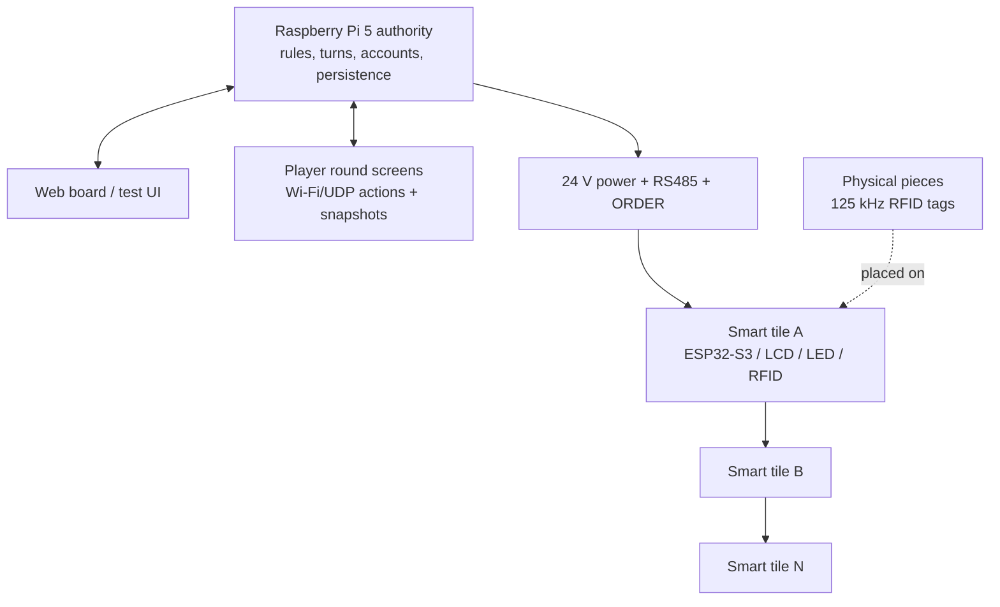

<h1 align="center">Gridopoly</h1>

<p align="center">
  A modular electronic board game platform with smart tiles, player control screens, physical pieces, and a Raspberry Pi authority server.
</p>

<p align="center">
  <a href="README.zh-CN.md">Chinese</a> &middot;
  <a href="#project-gallery">Gallery</a> &middot;
  <a href="#current-status">Status</a> &middot;
  <a href="#quickstart">Quickstart</a> &middot;
  <a href="Docs/README.md">Docs</a> &middot;
  <a href="Server/RaspberryPi/README.md">Raspberry Pi server</a>
</p>

<p align="center">
  
  
  
  
  
</p>

## Project Gallery

<table>
  <tr>
    <td width="50%" align="center">
      
      <br />
      <strong>Smart tile PCB.</strong> ESP32-S3, display, RFID, RS485, 24 V power distribution, current sensing, and edge contacts in one rearrangeable grid module.
    </td>
    <td width="50%" align="center">
      
      <br />
      <strong>Player control screen.</strong> Round 480x480 player terminal for turn actions, cash, assets, dice, trade, and game prompts.
    </td>
  </tr>
  <tr>
    <td width="50%" align="center">
      
      <br />
      <strong>Physical tile module.</strong> A real smart tile assembly with screen, USB-C, side contacts, LEDs, and board-level bring-up hardware.
    </td>
    <td width="50%" align="center">
      
      <br />
      <strong>Raspberry Pi authority.</strong> The central game server for rules, accounts, board state, web UI, player synchronization, and persistence.
    </td>
  </tr>
</table>

## Why This Exists

Gridopoly explores what a physical board game can become when the board itself is programmable. Instead of a fixed printed board, the system is built from independent smart tiles that can display their own state, detect pieces, animate LEDs, and communicate with a central authority.

The goal is not to copy the brand, map, art, cards, or product appearance of any existing commercial board game. Gridopoly keeps the social feeling of moving pieces around a real table, while replacing paper money, manual rent calculation, and fixed board content with software-controlled rules, assets, player screens, and dynamic maps.

## Current Status

Gridopoly has moved beyond an early single-tile concept. Most major software and interaction subsystems are now implemented or integrated in the repository:

- Raspberry Pi 5 authority server linked to the shared C++ game core and protocol stack.
- Web board/testing UI with map assets, owner badges, robot players, game creation, and forced-roll debugging.
- Authenticated Wi-Fi/UDP player-console protocol with HMAC sessions, replay protection, heartbeat, resync, and player detail queries.
- Player console UI specification for a 2.1 inch 480x480 round screen, including dice, assets, players, trades, payments, auctions, cards, debt, and reconnect flows.
- Bidirectional trade protocol with request/response flows, revisions, idempotency, counter-offers, robot responses, and atomic settlement.
- Persistent game state, room identity, device-to-seat binding, avatar setup, name setup, countdown, and final avatar publishing.
- Hardware baseline for smart tiles: ESP32-S3, ST7789, WS2812, HTRC110 RFID, RS485, ORDER chain, INA226 current sensing, 24 V bus, USB-C debug power, and 6-layer PCB design.
- Mechanical player-console stand assets and verification scripts.

Remaining work is mainly real-world validation: multi-tile hardware bring-up, RFID tuning, RS485/ORDER chain tests, power and thermal measurements, and full end-to-end playtesting across physical tiles, player consoles, and the authority server.

## System Architecture



## Core Features

- **Rearrangeable smart tiles**: each grid module can be manufactured, tested, replaced, and rearranged independently.
- **Physical-piece sensing**: each tile is designed around 125 kHz RFID detection for tagged game pieces.
- **Dynamic tile display**: ST7789 screens and WS2812 LEDs show ownership, events, status, and feedback.
- **Central game authority**: a Raspberry Pi owns the rules, turns, cash, assets, trades, auctions, debts, and persistence.
- **Player terminals**: round screens give each player their own cash, assets, dice, trade, payment, and reconnect interface.
- **Original Grid City content**: the repo includes board maps, visual systems, tile assets, avatars, contracts, and game rules.
- **Protocol-first design**: C++ core, binary protocol, UDP envelope, HTTP assets, and generated contracts are tested as first-class artifacts.

## Tech Stack

| Layer | Technology | Purpose |
| --- | --- | --- |
| Tile hardware | ESP32-S3, ST7789, WS2812, HTRC110, RS485, INA226 | Local display, lighting, RFID sensing, bus communication, current monitoring. |
| Player console | ESP32-S3, 480x480 round LCD, LVGL-oriented UI specs, Wi-Fi/UDP | Per-player controls, snapshots, actions, reconnect, and UI workflows. |
| Authority server | Raspberry Pi 5, C++17, systemd | Rules, persistence, HTTP board UI, UDP player sessions, and deployment. |
| Game core | C++ libraries | Board catalog, game engine, protocol codec, state machine, trades, auctions, cards, and bots. |
| Assets/contracts | JSON schemas, generated docs, PNG/RGB565/GAVC assets | Stable game content, tile art, avatars, and protocol contracts. |
| Hardware design | EasyEDA project snapshots, 6-layer PCB baseline | Smart tile PCB design, BOM, power, bus, and connector documentation. |

## Quickstart

Build and run the host-side C++ tests:

```bash
cmake -S . -B build -G Ninja -DCMAKE_BUILD_TYPE=Release
cmake --build build
ctest --test-dir build --output-on-failure
```

Build and test the Raspberry Pi server using the native guard script:

```bash
GRIDOPOLY_NATIVE_BUILD_DIR=/tmp/gridopoly-build \
  Server/RaspberryPi/tools/build-and-test-native.sh
```

Deploy on Raspberry Pi after building the server binary:

```bash
sudo sh Server/RaspberryPi/deploy/install.sh build-pi/gridopoly_server
sudoedit /etc/gridopoly/server.env
sudoedit /etc/gridopoly/ap.env
sudo systemctl enable --now gridopoly-ap gridopoly-dnsmasq gridopoly-ap-watchdog gridopoly
```

Player network endpoints after deployment:

- Web board on the player AP: `http://10.42.0.1/`
- Player binary protocol: UDP `10.42.0.1:4242`

## Documentation Map

Start here when working on a specific area:

- [Docs center](Docs/README.md)
- [Product goals](Docs/product/product-goals.md)
- [Hardware baseline](Docs/hardware/hardware-baseline.md)
- [ESP32-S3 pin map](Docs/hardware/esp32-s3-pin-map.md)
- [Module interconnect](Docs/hardware/module-interconnect-5wire.md)
- [Firmware development guide](Docs/firmware/firmware-development-guide.md)
- [Raspberry Pi authority server](Docs/firmware/raspberry-pi-server.md)
- [Wi-Fi/UDP player protocol](Docs/firmware/wifi-udp-player-protocol.md)
- [Trade protocol](Docs/firmware/trade-protocol.md)
- [Player console UI spec](Docs/player-console/player-console-ui-spec.md)
- [Game rules](Docs/game/game-rules.md)

## Repository Layout

```text
Gridopoly/
|-- Assets/                  Grid City tile art, avatars, manifests, and generated assets
|-- Docs/                    Product, hardware, firmware, game, player-console, and design docs
|-- Firmware/                ESP32 test server, shared core/protocol libraries, LVGL baseline
|-- GameData/                Schemas, generated contracts, and game data artifacts
|-- Mechanical/              Player console stand models, scripts, tests, and reports
|-- PCB Files/               EasyEDA project snapshots and PCB backups
|-- Server/RaspberryPi/      Formal authority server, deploy scripts, web/UDP services
|-- Tools/                   Contract generation tools and tests
|-- tests/host/              Host C++ tests for core, protocol, authority, UDP, HTTP, avatars
`-- CMakeLists.txt
```

## Safety And Release Notes

Gridopoly is an integrated prototype, not a manufacturing release. Before treating a board revision as production-ready, the project still needs final DRC, no-unrouted checks, component orientation review, switching-regulator layout review, current-path calculations, RFID tuning, and measured multi-module testing.

No open-source license has been selected yet. Public code and design files are available for inspection, but they are not automatically licensed for reuse, modification, or commercial use.