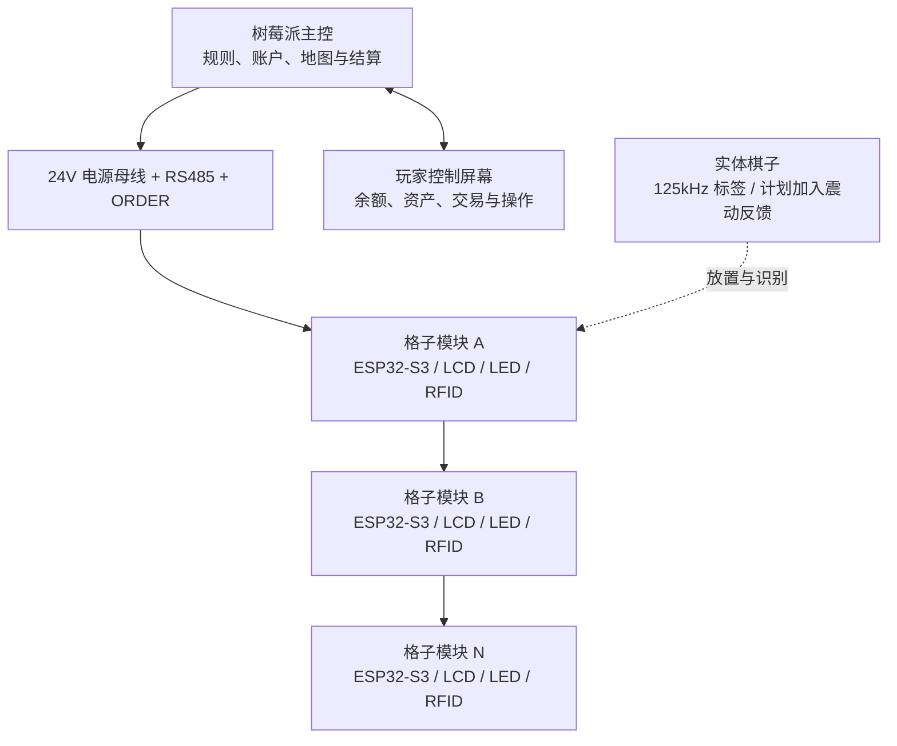

<h1 align="center">Gridopoly</h1>

<p align="center">
  一个由智能格子、实体棋子和中央主控组成的模块化电子桌游平台。
</p>

<p align="center">
  
  
  
  
</p>

<p align="center">
  <a href="#项目定位">项目定位</a> ·
  <a href="#系统架构">系统架构</a> ·
  <a href="#当前硬件">当前硬件</a> ·
  <a href="#项目状态">项目状态</a> ·
  <a href="Docs/README.md">硬件文档</a>
</p>

## 项目定位

Gridopoly 是一个面向创客和桌游开发者的可编程实体棋盘系统。棋盘不是一整块固定电路，而是由多个可独立显示、识别和通信的格子模块连接而成。

项目希望保留移动棋子、围桌交流和玩家交易等实体桌游体验，同时减少纸币、手工记账和固定印刷内容带来的限制。格子上的屏幕与灯光可以随游戏状态变化，树莓派负责全局规则、账户和回合流程。

Gridopoly 不以复制现有商业桌游的品牌、地图、美术、卡牌文字或产品外观为目标。项目将采用原创名称、视觉内容和规则表达，探索地产经营机制之外的更多可编程玩法。

## 核心能力

- **模块化棋盘**：每个格子可以独立测试、替换和重新排列。
- **自动顺序识别**：ORDER 链用于发现模块的实际物理排列顺序。
- **共享通信总线**：RS485 负责树莓派与多个格子模块之间的可靠通信。
- **动态格子内容**：2.0 英寸 ST7789 屏幕显示地块、事件和状态信息。
- **独立灯效**：每格 10 颗 WS2812，可分别设置颜色和动画。
- **棋子识别**：HTRC110 与外置 125kHz 天线读取 EM4100/TK4100 标签。
- **本地电流检测**：INA226 测量单个格子模块的 5V 输入电流。
- **双路调试供电**：模块支持 24V 母线本地降压，并保留 USB Type-C 调试供电。

## 系统架构



### 模块互连

模块之间使用 5 个电气网络和每侧 15 个物理触点：

| 网络 | 物理触点 | 用途 |
| --- | ---: | --- |
| `24V_BUS` | 6 | 模块供电母线 |
| `GND` | 6 | 电源回路与公共参考地 |
| `BUS_A` | 1 | RS485 差分信号 A |
| `BUS_B` | 1 | RS485 差分信号 B |
| `ORDER` | 1 | 逐级发现模块物理顺序 |

并联触点用于降低单个连接面的接触电阻，但不能替代分段供电。完整棋盘扩展到数十个模块时，需要使用多个 24V 注入点、电源分区或独立供电底板。

## 当前硬件

| 子系统 | 当前方案 | 作用 |
| --- | --- | --- |
| 本地主控 | ESP32-S3-WROOM-1-N16R8 | 屏幕、灯效、RFID、通信与本地状态 |
| 中央主控 | Raspberry Pi，软件尚未实现 | 游戏规则、账户、地图和模块管理 |
| 显示 | ST7789，240×320，只写 SPI | 显示格子内容 |
| 状态灯 | 10 × WS2812B-B-V6 | 独立寻址的环形状态灯 |
| RFID | HTRC110 + 外置约 384µH 天线 | 读取 125kHz 无源标签 |
| 模块总线 | SN65HVD75 半双工 RS485 | 多模块数据通信 |
| 顺序检测 | GPIO + 2N7002 开漏链路 | 自动识别物理连接顺序 |
| 母线供电 | 24V 分布，LMR16030 本地降至 5V | 降低长链路电流与压降 |
| 电源选择 | TPS2121 | 本地 5V 与 USB VBUS 二选一 |
| 系统电源 | AP63203，5V 转 3.3V | ESP32-S3 与 3.3V 外设供电 |
| 电流检测 | INA226 + 10mΩ 分流电阻 | 测量单模块 5V 输入电流 |

本地主要供电路径：

```text
24V_BUS -> 保护与保险 -> LMR16030 -> 5V_FROM_24
USB_VBUS -------------------------------> TPS2121
5V_FROM_24 -----------------------------> TPS2121
TPS2121 -> 5V_SELECTED -> INA226 分流电阻 -> 5V_IN
5V_IN -> AP63203 -> 3V3_SYS
5V_IN -> 磁珠滤波 -> 5V_RFID
```

## 从这里开始

当前仓库主要包含硬件设计和接口文档，ESP32-S3 固件与树莓派控制软件尚未加入。开始阅读时建议按以下顺序：

1. [产品目标](Docs/product-goals.md)：了解产品边界、交互目标和里程碑。
2. [硬件文档索引](Docs/README.md)：查看当前硬件架构和网络命名。
3. [ESP32-S3 引脚与接口定义](Docs/esp32-s3-pin-map.md)：用于固件板级配置和接线核对。
4. [模块互连方案](Docs/module-interconnect-5wire.md)：了解 24V、RS485、ORDER 和自动枚举。
5. [原理图历史审查](Docs/schematic-review-2026-07-27.md)：仅用于追溯历史问题，不作为当前接线依据。

## 项目状态

Gridopoly 目前处于**单格模块硬件原型阶段**。

### 已完成

- 单格模块的主要硬件架构与网络规划。
- ESP32-S3、屏幕、WS2812、RFID、RS485、ORDER 和 INA226 的原理图连接。
- 24V 母线、本地 5V/3.3V 电源以及 USB 调试供电方案。
- 3×5 磁吸触点的输入、输出和镜像针序定义。
- 当前引脚、接口、电源网络与 BOM 文档整理。

### 正在进行

- PCB 元件布局、布线和设计规则收敛。
- 24V 转 5V 开关电源布局复核。
- USB 差分线、RS485、RFID 模拟网络和载流路径检查。
- DRC、未连接网络和可制造性检查。

### 尚未验证

- PCB 实物打样与通电测试。
- RFID 天线的实测电感、Q 值和 125kHz 谐振调谐。
- 多模块 RS485 通信与 ORDER 自动枚举。
- 长链路 24V 压降、磁吸触点温升和分段供电。
- 屏幕刷新、图片传输、灯效和完整游戏流程。

> [!CAUTION]
> 当前设计不能视为已经完成投产验证。下单前仍需完成完整 DRC、未布线检查、器件方向复核、开关电源布局检查、载流能力计算和工程样板测试。

## 近期路线

1. 完成单格模块 PCB 并通过设计审查。
2. 打样并逐项验证 24V、5V、3.3V 与 USB 供电。
3. 编写 ESP32-S3 板级测试固件。
4. 验证 ST7789 显示和 10 颗 WS2812 独立控制。
5. 调谐 RFID 天线并完成 EM4100/TK4100 ID 解码。
6. 连接 2～3 个模块，验证 RS485 与 ORDER 枚举。
7. 开发树莓派测试主控和玩家控制界面。
8. 完成小规模棋盘片段后，再扩展到完整棋盘。

## 设计原则

- **模块优先**：一个格子可以独立制造、测试和替换。
- **实体优先**：电子系统增强实体桌游，而不是把它变成普通屏幕游戏。
- **原创表达**：品牌、地图、美术、文字和产品外观保持独立设计。
- **先验证再扩展**：先完成单格和小规模链路，再制作完整棋盘。
- **文档与设计同步**：引脚定义以当前 EasyEDA 设计复核结果为准。

## 参与项目

目前最有价值的贡献方向包括：

- ESP-IDF 板级驱动与硬件自检固件。
- ST7789 图片传输和资源管理。
- HTRC110 驱动及 EM4100/TK4100 解码。
- RS485 通信协议与 ORDER 枚举状态机。
- 树莓派游戏控制服务和玩家界面。
- PCB、电源完整性、EMC、RFID 天线和结构设计审查。

提交修改前，请确保网络名、GPIO、连接器针序和文档保持一致。涉及电源、磁吸触点或 RFID 天线的修改，应附带计算依据或实测结果。

## 项目说明

本仓库当前未提供开源许可证。公开代码和设计文件不等同于自动授予复制、修改或商业使用许可；在许可证确定前，请先联系项目维护者。
