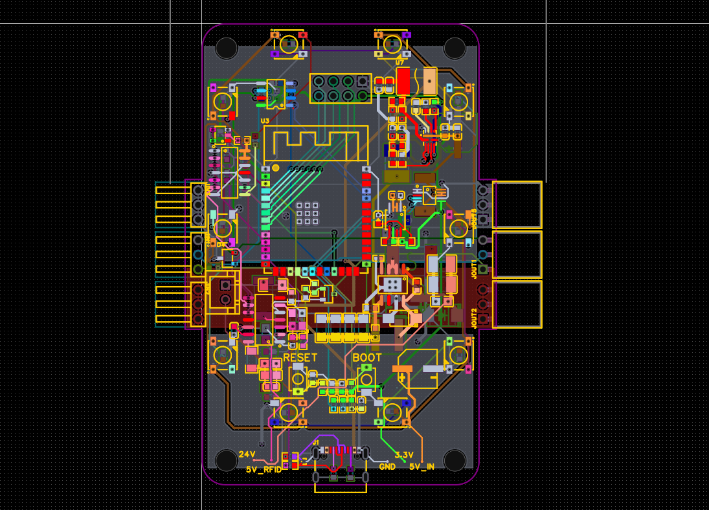
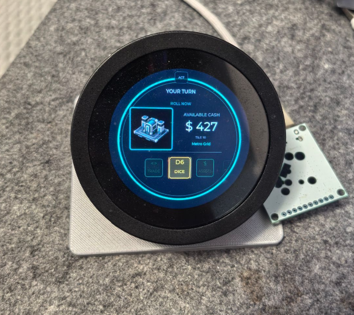
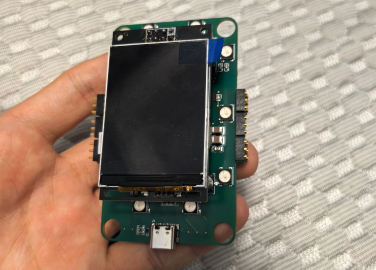
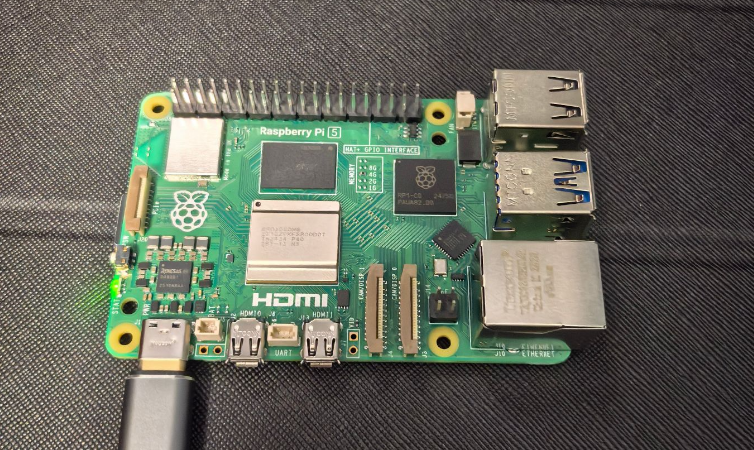
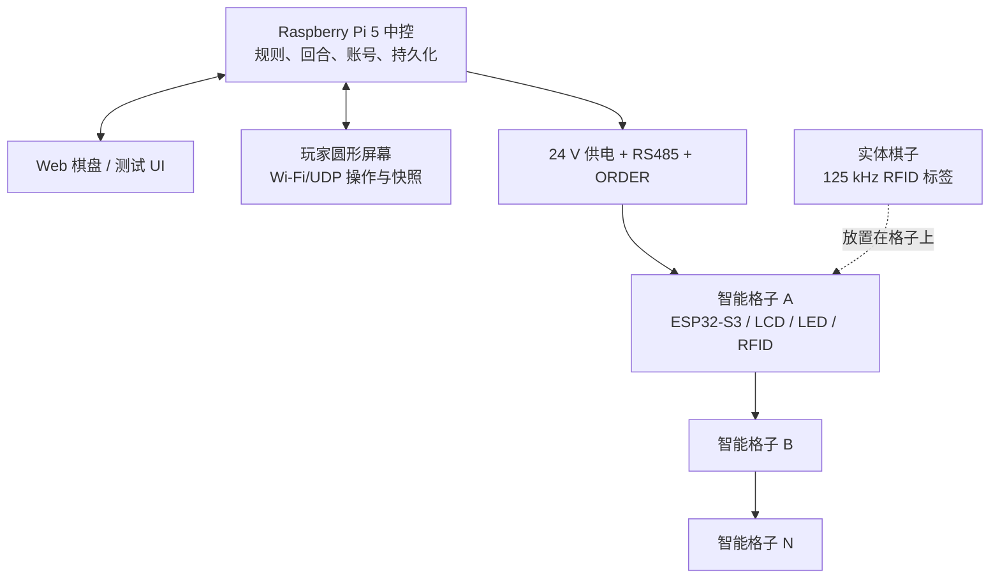

<h1 align="center">Gridopoly</h1>

<p align="center">
  一个模块化电子桌游平台：由智能格子、玩家控制屏幕、实体棋子和 Raspberry Pi 中控服务器组成。
</p>

<p align="center">
  <a href="README.md">English</a> &middot;
  <a href="#项目图集">项目图集</a> &middot;
  <a href="#当前进度">当前进度</a> &middot;
  <a href="#快速开始">快速开始</a> &middot;
  <a href="Docs/README.md">开发文档</a> &middot;
  <a href="Server/RaspberryPi/README.md">树莓派服务器</a>
</p>

<p align="center">
  
  
  
  
  
</p>

## 项目图集

<table>
  <tr>
    <td width="50%" align="center">
      
      <br />
      <strong>格子模块 PCB 设计。</strong> 单个可重排智能格子集成 ESP32-S3、屏幕、RFID、RS485、24 V 供电、电流检测和边缘连接触点。
    </td>
    <td width="50%" align="center">
      
      <br />
      <strong>玩家控制屏幕。</strong> 480x480 圆形终端，用于显示回合、现金、资产、骰子、交易和游戏提示。
    </td>
  </tr>
  <tr>
    <td width="50%" align="center">
      
      <br />
      <strong>格子模块实体展示。</strong> 已经进入实物调试阶段的智能格子，包含屏幕、USB-C、侧边触点、LED 和板级验证硬件。
    </td>
    <td width="50%" align="center">
      
      <br />
      <strong>树莓派游戏中控服务器。</strong> 负责规则、账号、棋盘状态、网页界面、玩家同步和持久化。
    </td>
  </tr>
</table>

## 项目动机

Gridopoly 想探索一件很有意思的事：如果桌游的棋盘本身是可编程的，实体桌游会变成什么样？

它不是一张固定印刷的纸板，而是由一块块独立智能格子组成。每个格子都能显示自己的状态、识别实体棋子、驱动灯效，并且通过总线与游戏中控通信。玩家仍然围在真实桌面前移动棋子，但现金、资产、租金、交易、事件和地图内容都由软件系统实时管理。

这个项目不是复刻任何现有商业桌游的品牌、地图、美术、卡牌或产品外观。它保留实体桌游面对面互动的感觉，同时把纸币结算、租金计算、固定棋盘和手动规则执行，升级成由硬件和软件共同驱动的原创 Grid City 游戏系统。

## 当前进度

Gridopoly 已经从早期单格原型推进到完整系统集成阶段。仓库里大部分核心软件、交互和硬件设计内容已经开发完成或进入验证：

- Raspberry Pi 5 中控服务器已经接入共享 C++ 游戏核心和协议栈。
- Web 棋盘/测试 UI 已支持地图素材、归属标记、机器人玩家、创建游戏和强制掷骰调试。
- 玩家控制屏使用带认证的 Wi-Fi/UDP 协议，包含 HMAC 会话、重放保护、心跳、重同步和玩家详情查询。
- 2.1 英寸 480x480 圆屏玩家终端已有完整 UI 规格，覆盖骰子、资产、玩家、交易、付款、拍卖、卡牌、债务和断线重连。
- 双向交易协议已经覆盖请求、响应、版本、幂等、反报价、机器人响应和原子结算。
- 已实现游戏状态持久化、房间身份、设备座位绑定、头像设置、名称设置、倒计时和最终头像发布。
- 智能格子硬件基线包含 ESP32-S3、ST7789、WS2812、HTRC110 RFID、RS485、ORDER 链、INA226 电流检测、24 V 总线、USB-C 调试供电和 6 层 PCB 设计。
- 玩家控制屏支架、机械资产和验证脚本也已经进入仓库。

剩余重点主要是现实世界验证：多格硬件联调、RFID 调谐、RS485/ORDER 链路测试、供电与温升测量，以及把实体格子、玩家控制屏和中控服务器连起来做完整试玩。

## 系统架构



## 核心能力

- **可重排智能格子**：每个格子模块都可以独立制造、测试、更换和重新排列。
- **实体棋子识别**：每个格子围绕 125 kHz RFID 设计，用于识别带标签的棋子。
- **动态格子显示**：ST7789 屏幕和 WS2812 灯效显示归属、事件、状态和反馈。
- **中央规则中控**：Raspberry Pi 负责规则、回合、现金、资产、交易、拍卖、债务和持久化。
- **玩家终端**：圆形控制屏给每个玩家独立的现金、资产、骰子、交易、付款和重连界面。
- **原创 Grid City 内容**：仓库包含棋盘地图、视觉系统、格子素材、头像、合约和游戏规则。
- **协议优先设计**：C++ 核心、二进制协议、UDP 包络、HTTP 资源和生成合约都作为一等工程资产进行测试。

## 技术栈

| 层级 | 技术 | 用途 |
| --- | --- | --- |
| 格子硬件 | ESP32-S3、ST7789、WS2812、HTRC110、RS485、INA226 | 本地显示、灯效、RFID 识别、总线通信和电流监测。 |
| 玩家控制屏 | ESP32-S3、480x480 圆形 LCD、面向 LVGL 的 UI 规格、Wi-Fi/UDP | 玩家操作、状态快照、动作提交、重连和交互流程。 |
| 中控服务器 | Raspberry Pi 5、C++17、systemd | 规则、持久化、HTTP 棋盘界面、UDP 玩家会话和部署。 |
| 游戏核心 | C++ libraries | 棋盘目录、游戏引擎、协议编解码、状态机、交易、拍卖、卡牌和机器人。 |
| 素材/合约 | JSON schemas、生成文档、PNG/RGB565/GAVC 资源 | 稳定游戏内容、格子美术、头像和协议合约。 |
| 硬件设计 | EasyEDA 项目快照、6 层 PCB 基线 | 智能格子 PCB、BOM、供电、总线和连接器文档。 |

## 快速开始

构建并运行主机侧 C++ 测试：

```bash
cmake -S . -B build -G Ninja -DCMAKE_BUILD_TYPE=Release
cmake --build build
ctest --test-dir build --output-on-failure
```

使用原生保护脚本构建并测试 Raspberry Pi 服务器：

```bash
GRIDOPOLY_NATIVE_BUILD_DIR=/tmp/gridopoly-build \
  Server/RaspberryPi/tools/build-and-test-native.sh
```

构建服务器二进制后，在 Raspberry Pi 上部署：

```bash
sudo sh Server/RaspberryPi/deploy/install.sh build-pi/gridopoly_server
sudoedit /etc/gridopoly/server.env
sudoedit /etc/gridopoly/ap.env
sudo systemctl enable --now gridopoly-ap gridopoly-dnsmasq gridopoly-ap-watchdog gridopoly
```

部署后的玩家网络入口：

- 玩家 AP 上的 Web 棋盘：`http://10.42.0.1/`
- 玩家二进制协议：UDP `10.42.0.1:4242`

## 文档导航

按工作区域从这里开始：

- [文档中心](Docs/README.md)
- [产品目标](Docs/product/product-goals.md)
- [硬件基线](Docs/hardware/hardware-baseline.md)
- [ESP32-S3 引脚图](Docs/hardware/esp32-s3-pin-map.md)
- [模块互连](Docs/hardware/module-interconnect-5wire.md)
- [固件开发指南](Docs/firmware/firmware-development-guide.md)
- [Raspberry Pi 中控服务器](Docs/firmware/raspberry-pi-server.md)
- [Wi-Fi/UDP 玩家协议](Docs/firmware/wifi-udp-player-protocol.md)
- [交易协议](Docs/firmware/trade-protocol.md)
- [玩家控制屏 UI 规格](Docs/player-console/player-console-ui-spec.md)
- [游戏规则](Docs/game/game-rules.md)

## 仓库结构

```text
Gridopoly/
|-- Assets/                  Grid City 格子美术、头像、清单和生成资源
|-- Docs/                    产品、硬件、固件、游戏、玩家屏幕和设计文档
|-- Firmware/                ESP32 测试服务器、共享核心/协议库、LVGL 基线
|-- GameData/                Schema、生成合约和游戏数据产物
|-- Mechanical/              玩家控制屏支架模型、脚本、测试和报告
|-- PCB Files/               EasyEDA 项目快照和 PCB 备份
|-- Server/RaspberryPi/      正式中控服务器、部署脚本、Web/UDP 服务
|-- Tools/                   合约生成工具和测试
|-- tests/host/              核心、协议、中控、UDP、HTTP、头像等主机测试
`-- CMakeLists.txt
```

## 安全与发布说明

Gridopoly 是一个集成原型，不是量产发布版本。在把任何板卡版本视为生产就绪之前，还需要完成最终 DRC、无飞线检查、元件方向复核、开关稳压器布局复核、电流路径计算、RFID 调谐和实测多模块联调。

目前仓库还没有选择开源许可证。公开代码和设计文件可供查看，但并不自动授权复用、修改或商业使用。